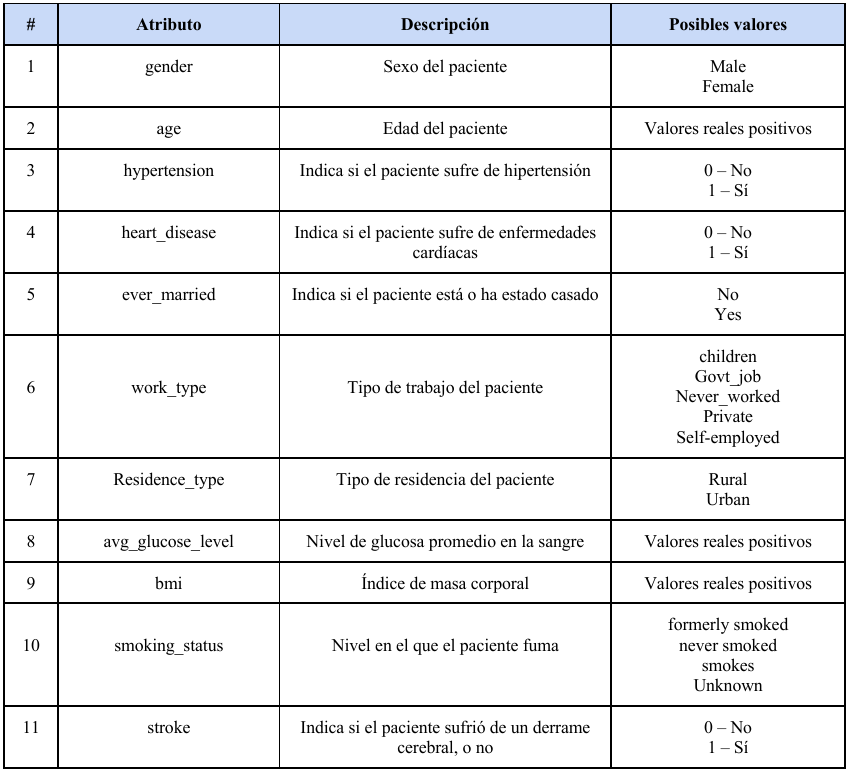
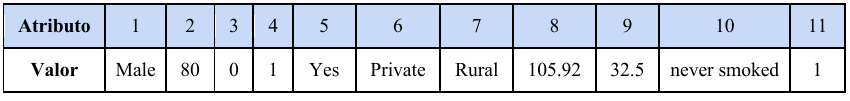

# Informe Inteligencia Artificial: Machine Learning

Integrantes del grupo de trabajo:

- Diego Botero
- Yurani Ipia
- Kevin Marín
- Nicolas Pineda

Docente: Oscar Bedoya

El objetivo de este informe es crear dos notebooks. Uno donde se utilice la técnica de redes neuronales y otro para la técnica de árboles de decisión, con el objetivo de entrenar modelos que permitan predecir si una persona sufrirá o no de un derrame cerebral.

Inicialmente se prueban diferentes topologías de redes neuronales y se modifican los hiperparámetros, para el caso de los árboles de desición se varía la profundidad máxima `max_depth` y otros hiperparametros. Se busca una mayor precisión `accuracy` con las distintas configuraciones.

Se usará un conjunto de datos de 700 personas, algunas de las cuales sufrieron derrame cerebral.

Cada persona se describe utilizando 11 atributos que se presentan en la tabla. Estas variables incluyen el sexo, la edad, si el paciente sufre de hipertensión o enfermedades cardíacas, entre otra información.

La etiqueta de clase o variable dependiente es el atributo stroke cuyos valores pueden ser 1 ó 0, indicando si la persona sufrió o no un derrame cerebral.

En la siguiente tabla se muestra como ejemplo la información de un paciente. Se trata de un hombre (atributo 1), de 80 años (atributo 2), que no sufre de hipertensión (atributo 3), pero sí de enfermedades cardíacas (atributo 4), ha estado casado (atributo 5), trabajó en el sector privado (atributo 6), vive en una residencia de tipo rural (atributo 7), su nivel de glucosa es de 105.92 (atributo 8), su índice de masa corporal es 32.5 (atributo 9), y nunca ha fumado (atributo 10).

Esta persona tuvo un derrame cerebral (atributo 11, etiqueta de clasificación a predecir).

